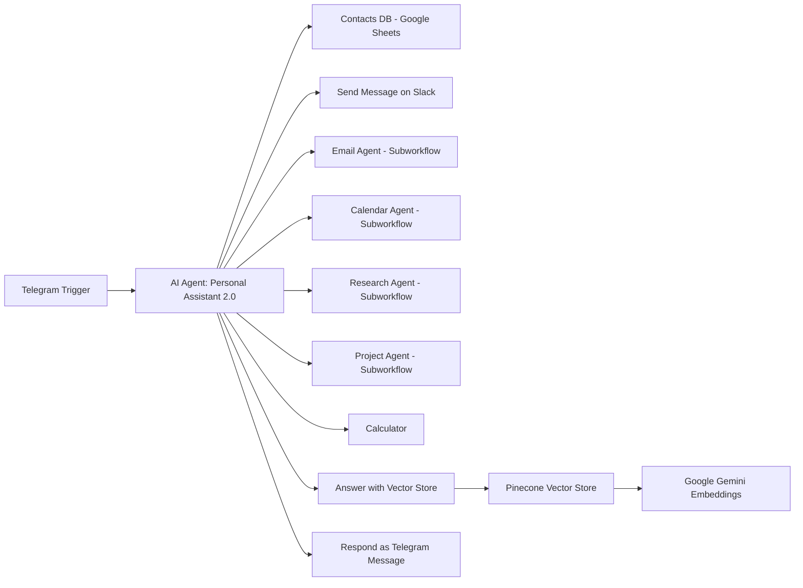

# Personal Assistant 2.0

> An AI-powered automation assistant built on n8n to manage emails, calendars, research, projects, and knowledge queries—end-to-end from a single chat entry point.


---

# Overview

**Personal Assistant 2.0** is a production-ready, modular assistant orchestrated in **n8n**. It connects **Telegram** (as the chat interface) with operational tools **Gmail**, **Google Calendar**, **Google Sheets**, **Slack** and augments them with **GPT-4.1-mini** for reasoning, **Google Gemini embeddings** for semantic search, and **Pinecone** for vector retrieval.

The assistant:

* Reads and sends emails, and summarizes inbox slices.
* Creates, retrieves, and summarizes calendar events (IST timezone by design).
* Searches knowledge sources (Wikipedia → Hacker News → Serp API).
* Logs, reads, and updates project data in Google Sheets.
* Answers company-specific questions with a vector store.
* Routes replies back to the user over Telegram.

---

# Main Workflow


---

## 🗺️ Workflow Diagram (Mermaid)



---

# Node-by-Node Configuration

## Main Workflow

### Step 1 — Telegram Trigger

* **Trigger**: On message (incoming Telegram message).

### Step 2 — AI Agent (Personal Assistant 2.0 Agent)

* **Source for Prompt (User Message)**:
  `{{ $json.message.text }}`
* **Toggles**:

  * Require Specific Output Format → **Enabled**
  * Enable Fallback Model → **Enabled**
* **System Message (exact)**:

  ```
  You are a personal assistant AI Agent designed to handle various tasks efficiently. Your primary role is to manage contacts, emails, and calendar events for the user. You have access to three tools to help you fulfill requests:

  # Contacts Data: Use this when you need to look up contact information like an email address. You need to use this tool BEFORE sending an email or BEFORE getting emails.

  # Email Agent: Use this for handling all email-related actions, like sending messages, setting up replies, or forwarding emails.

  # Calendar Agent: Use this for scheduling, updating, or managing calendar events.

  # Send Slack Message: Use this to send a message in Slack.

  # Project Agent: Use this tool to access our projects. We can update our projects of get information on our projects.

  When a task requires using one or more of these tools, make sure to identify which tool is most appropriate, pass along the relevant details, and execute the actions needed to complete the task. Your goal is to be proactive, precise, and organized in managing these resources to provide a smooth experience for the user.

  Here is the current time/date: {{ $now.format('DD')}}
  ```
* **Also used in practice**: Current time/date string
  `Sep 29, 2025`
* **Chat Model Node**: **GPT-4.1-mini** (decision & reasoning)
* **Memory**: **Enabled** (context retention)
* **Connected Tools (8 total)**:

  1. **Contacts Data (Google Sheets)** — lookup before emailing.
  2. **Email Agent** — subworkflow (see details below).
  3. **Calendar Agent** — subworkflow (see details below).
  4. **Send Slack Message** — direct send to Slack channel.
  5. **Project Agent** — subworkflow (see details below).
  6. **Research Agent** — subworkflow (see details below).
  7. **Calculator** — math operations.
  8. **Answer Question with Vector Store** — Pinecone RAG chain.

#### Step 2.1 — Google Sheet (Contacts DB)

* **Credential**: `Google Sheets AIS`
* **Resource**: Sheet Within Document
* **Operation**: Get Row(s)
* **Document**: `Contacts`
* **Sheet**: `Sheet1`
* **Filters**: none (Combine Filters: AND)

#### Step 2.2 — Send Message on Slack

* **Credential**: `Sachin AIS`
* **Resource**: Message
* **Operation**: Send
* **Target**: Channel → `all-sachin-ais`
* **Message Type**: Simple Text Message
* **Message Text**:
  `{{ $fromAI("message","the message the user wants to send in Slack") }}`
* **Option**: Include Link to Workflow

#### Step 2.3 — Email Agent (Subworkflow)

* See **Email Agent Subworkflow** section.

#### Step 2.4 — Calendar Agent (Subworkflow)

* See **Calendar Agent Subworkflow** section.

#### Step 2.5 — Research Agent (Subworkflow)

* See **Research Agent Subworkflow** section.

#### Step 2.6 — Project Agent (Subworkflow)

* See **Project Agent Subworkflow** section.

#### Step 2.7 — Calculator

* **Purpose**: General calculations (no extra params required).

#### Step 2.8 — Answer Question with Vector Store (Direct Tool)

* **Step 2.8.1** — **Answer questions with a vector store**

  * **Description of Data**: “Call this tool to get information about the company.”
  * **Limit**: `4`
* **Step 2.8.2** — **Pinecone Vector Store**

  * **Credential**: `PineconeApi account`
  * **Operation Mode**: *Retrieve Documents (As Vector Store for Chain/Tool)*
  * **Index**: `n8n-sample`
  * **Rerank Results**: Enabled
  * **Namespace (Options)**: `Body Shop T&C`
* **Embeddings Node**: **Google Gemini Embeddings** → upstream for Pinecone indexing/querying.
* **LLM Synthesis**: GPT-4.1-mini composes final answer from retrieved context.

---

## Email Agent Subworkflow (Tool 3)


### Step 2.3.1 — When Executed by Another Workflow

* Entry point when called by the main workflow.

### Step 2.3.2 — Email Agent

* **Agent**: Tools Agent
* **Source for Prompt**: `{{$json.query}}`
* **Require Specific Output Format**: Enabled
* **System Message (exact)**:

  ```
  You are a helpful assistant. 

  If a number of emails isn't specified, just assume it will be 5.

  When sending an email, always sign it off from Sachin Savkare, never include something like [Your Name]
  ```
* **Chat Model**: **GPT-4.1-mini**
* **Memory**: Enabled

**Input Tools**

1. **Get Email: Limit: Sender**

   * **Credential**: `Gmail AIS`
   * **Resource**: Message
   * **Operation**: Get Many
   * **Return All**: true
   * **Limit**: `{{$fromAI("limit","how many emails the user asked for")}}`
   * **Filters → Sender**: `{{$fromAI("senderEmail","who the user is asking for emails from")}}`
2. **Send Email**

   * **Credential**: `Gmail AIS`
   * **Resource**: Message
   * **Operation**: Send
   * **To**: `{{ $fromAI("email","the email of a contact") }}`
   * **Subject**: `{{ $fromAI("subject","the subject for the email") }}`
   * **Email Type**: Text
   * **Message**: `{{ $fromAI("emailbody","the body message of the email") }}`
   * **Options**: Append n8n Attribution

**Responses**

* **Step 2.3.3.1 — Error (Response to PA 2.0 – Try Again)**

  * `response` = `"Unable to perform task. Please try again."`
* **Step 2.3.3.2 — Success (Response to PA 2.0 – Success)**

  * `response` = `{{$json.output}}`

---

## Calendar Agent Subworkflow (Tool 4)


### Step 2.4.1 — When Executed by Another Workflow

* Entry point when called by the main workflow.

### Step 2.4.2 — Calendar Agent

* **Source for Prompt**: `{{ $json.query }}`
* **Require Specific Output Format**: Enabled
* **Enable Fallback Model**: Enabled
* **System Message (exact)**:

  ```
  You are a calendar assistant. You have access to multiple tools to take any action within the calendar. 
  Always work in IST (Indian Standard Time) timezone.

  Here is the current date/time (IST): {{ $now }}

  Create Event:
  - If an end date isn't specified for the event, assume it will be 60 minutes long.
  - Use this tool if there is NO attendee specified.

  Create Event with Attendee:
  - If an end date isn't specified for the event, assume it will be 60 minutes long.
  - Use this tool WHEN AN ATTENDEE IS SPECIFIED.

  Get Events:
  - Use this tool to retrieve events from a specific day and provide a summarized list of those events.
  ```
* **Chat Model**: **GPT-4.1-mini**
* **Memory**: Enabled

**Input Tools**

1. **Get Events**

   * **Credential**: `Google Calendar account AIS`
   * **Resource**: Event
   * **Operation**: Get Many
   * **Calendar**: `sachinsavkare08@gmail.com`
   * **Return All**: true
   * **Limit**: `50`
   * **After**: `{{ $fromAI("oneDayBefore","one day before the day that the user requested") }}`
   * **Before**: `{{ $fromAI("oneDayAfter","one day after the day that the user requested") }}`
2. **Create Event**

   * **Credential**: `Google Calendar account AIS`
   * **Resource**: Event
   * **Operation**: Create
   * **Calendar**: `sachinsavkare08@gmail.com`
   * **Start**: `{{ $fromAI("oneDayBefore","one day before the day that the user requested") }}`
   * **End**: `{{ $fromAI("oneDayAfter","one day after the day that the user requested") }}`
   * **Use Default Reminders**: true
   * **Additional Fields → Summary**: `{{ $fromAI("name","the name of the calendar event") }}`
3. **Create Event with Attendee**

   * **Credential**: `Google Calendar account AIS`
   * **Resource**: Event
   * **Operation**: Create
   * **Calendar**: `sachinsavkare08@gmail.com`
   * **Start**: `{{ $fromAI("starttime","the time the user asks for the event to start") }}`
   * **End**: `{{ $fromAI("endtime","the time the user asks for the event to end") }}`
   * **Use Default Reminders**: true
   * **Additional Fields → Attendees**: `{{ $fromAI("attendeeEmail","the email of the user asks the event to be sceduled with") }}`
   * **Additional Fields → Summary**: `{{ $fromAI("name","the name of the calendar event") }}`

**Responses**

* **Step 2.4.3.1 — Error (Output to PA 2.0 – Try Again)**

  * `response` = `"Unable to perform task. Please try again."`
* **Step 2.4.3.2 — Success (Response to PA 2.0 – Success)**

  * `response` = `{{$json.output}}`

---

## Research Agent Subworkflow (Tool 5)


### Step 2.5.1 — When Executed by Another Workflow

* Entry point when called by the main workflow.

### Step 2.5.2 — Research Agent

* **Source for Prompt**: `{{ $json.query }}`
* **Require Specific Output Format**: Enabled
* **Enable Fallback Model**: Enabled
* **System Message (exact)**:

  ```
  You are a research assistant agent. You have Wikipedia, Hacker News API, and Serp API at your disposal. 

  To answer the user's question, first search wikipedia. If you can't find your answer there, then search articles using Hacker News API. If that doesn't work either, then use Serp API to answer the user's question.
  ```
* **Chat Model**: **GPT-4.1-mini**
* **Memory**: Enabled

**Input Tools**

1. **Wikipedia**

   * **Resource**: Article
   * **Operation**: Get
   * **Article ID**: defined automatically by the model
2. **Hacker News**

   * **Resource**: Article
   * **Operation**: Get
   * **Article ID**: defined automatically by the model
3. **Serp API**

   * **Credential**: `Serp API AIS`
   * **Options**: default

**Responses**

* **Step 2.5.3.1 — Error (Response to PA 2.0 – Try Again)**

  * `response` = `"Unable to perform task. Please try again."`
* **Step 2.5.3.2 — Success (Response to PA 2.0 – Success)**

  * `response` = `{{$json.output}}`

---

## Project Agent Subworkflow (Tool 6)


### Step 2.6.1 — When Executed by Another Workflow

* Entry point when called by the main workflow.

### Step 2.6.2 — Project Agent Database

* **Source for Prompt**: `{{$json.query}}`
* **Require Specific Output Format**: Enabled
* **Enable Fallback Model**: Enabled
* **System Message (exact)**:

  ```
  You are a google sheets agent. Your job is to take the user query and decide which tool to use to get the job done. 

  Your tools:
  Add Contact
  Use this tool to add a contact to the contact database

  Update Contact
  Use this tool to update a row for a specific contact. The fields for a contact are Name, Email, and Phone Number. If not all of these are specified to update, then keep them as they are. Example, if we want to update Nate Herk's email, pass along the updated email, but keep the current Name and Phone Number the same. 

  Get Projects
  Use this tool to get project information and summarize it.

  Update Projects
  Use this tool to update a row for a specific contact. The fields for a contact are Project, Notes, and Status. If not all of these are specified to update, then keep them as they are. 
  ```
* **Chat Model**: **OpenAI Chat Model1 (GPT-based)**
* **Memory**: Enabled

**Input Tools**

1. **Get Rows: Project Database**

   * **Credential**: `Google Sheets AIS`
   * **Resource**: Sheet Within Document
   * **Operation**: Get Row(s)
   * **Document**: `3. Update Database Projects`
   * **Sheet**: `Sheet1`
   * **Filters**: none (Combine Filters: AND)
2. **Update Projects**

   * **Credential**: `Google Sheets AIS`
   * **Resource**: Sheet Within Document
   * **Operation**: Update Row
   * **Document**: `3. Update Database Projects`
   * **Sheet**: `Sheet1`
   * **Mapping Column Mode**: Map Each Column Manually
   * **Column to Match On**: `Project`
   * **Values to Update**:

     * **Project (using to match)**: `{{ $fromAI("project") }}`
     * **Notes**: `{{ $fromAI("notes") }}`
     * **Status**: `{{ $fromAI("status") }}`

**Responses**

* **Step 2.6.3.1 — Error (Response to PA 2.0 – Try Again)**

  * `response` = `"Unable to perform task. Please try again."`
* **Step 2.6.3.2 — Success (Response to PA 2.0 – Success)**

  * `response` = `{{$json.output}}`

---

# Benefits

* **Single conversational interface** that orchestrates multiple business tools.
* **Deterministic tool selection** with GPT-4.1-mini and explicit system messages.
* **IST-aware scheduling** with safe defaults (60-minute events when end time is absent).
* **Auditable research chain** (Wikipedia → Hacker News → Serp API).
* **RAG capability** via Gemini embeddings + Pinecone for company knowledge.
* **Extensible design**—add tools or swap providers with minimal changes.

---

# Free Templates

> Place exported JSON files in `templates/` and update links as needed.

* [Main Workflow Template](https://github.com/SachinSavkare/Personal-Assistant-2.0-n8n/blob/main/11.1%20Personal%20Agent%202.0.json)
* [Email Agent Subworkflow](https://github.com/SachinSavkare/Personal-Assistant-2.0-n8n/blob/main/11.3%20%E2%9A%99%EF%B8%8FEmail%20Agent%202.0.json)
* [Calendar Agent Subworkflow](https://github.com/SachinSavkare/Personal-Assistant-2.0-n8n/blob/main/11.2%20%E2%9A%99%EF%B8%8FCalendar%20Agent%202.0.json)
* [Research Agent Subworkflow](https://github.com/SachinSavkare/Personal-Assistant-2.0-n8n/blob/main/Research%20Agent%20Subworkflow.JPG)
* [Project Agent Subworkflow](https://github.com/SachinSavkare/Personal-Assistant-2.0-n8n/blob/main/11.4%20%E2%9A%99%EF%B8%8F%20Project%20Agent%20Database.json)

---

# Author

**Sachin Savkare**

* GitHub: [@SachinSavkare](https://github.com/SachinSavkare)
* LinkedIn: [Sachin Savkare](https://linkedin.com/in/sachinsavkare)

---

# Notes

* Ensure n8n workflow **timezone** is aligned with **IST** for the calendar steps.
* The **Vector Store** is an **input tool** within the **Main Workflow** (not a subworkflow).
* All system messages, parameters, and node names above reflect the final verified configuration from the shared attachments and specifications.
